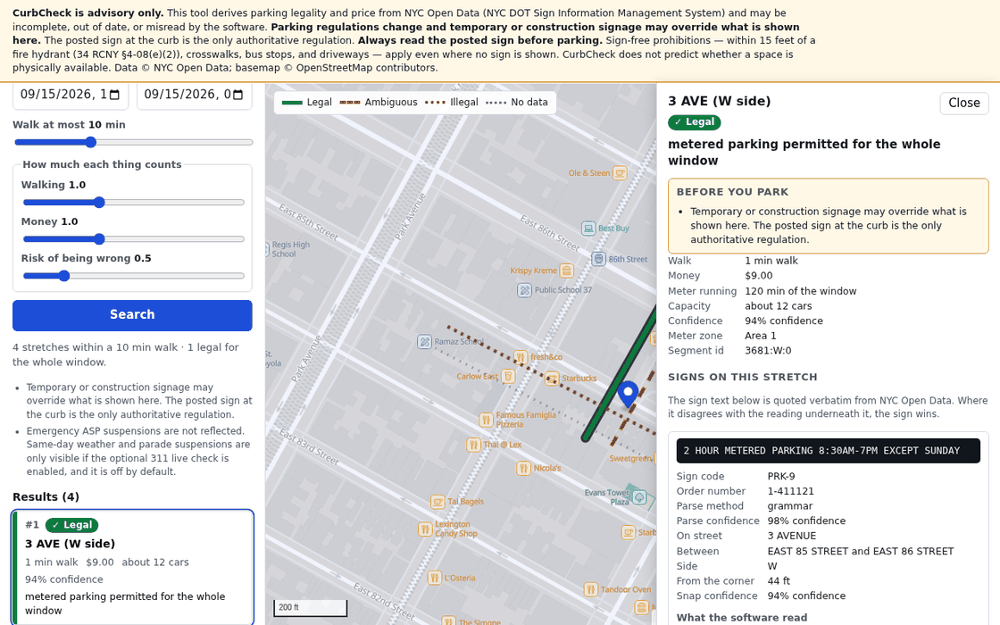
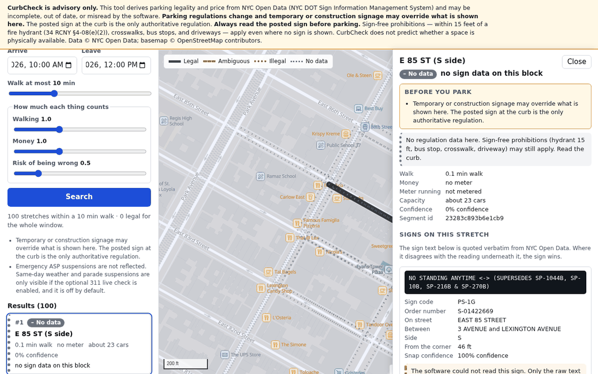

# CurbCheck

CurbCheck answers one question about Manhattan: *"I need to be at address X
between T1 and T2 — where can I legally leave a passenger car for that whole
window, and what will it cost me in walking and money?"* It builds a curb model
from NYC Open Data: every DOT parking sign is snapped onto the correct side of
the correct blockface by linear referencing, its `sign_description` text is read
by a deterministic grammar into a structured rule, overlapping rules are stacked
most-restrictive-wins over your time window, metered spans are priced against
ParkNYC rates, and the survivors are ranked. It is a single-user app: one ETL
run downloads the data, and after that the server runs offline, bound to
`127.0.0.1`, with no telemetry and no remote assets of any kind.





## Safety posture

**CurbCheck is advisory only: the posted sign at the curb is the only
authoritative regulation, and you must read it before you park.** The app can be
wrong in three ways — the source data can be stale or incomplete, the sign text
can be misread by the software, and temporary or construction signage (which is
largely absent from the source dataset) can override everything shown here.
That is why the UI never collapses its answer into "yes/no": **green** means
parking is permitted for every minute of your window, **red** means it is
prohibited for at least part of it, **amber** means the machine could not
confidently read the rules here, and **grey** means there is no sign data on
that blockface at all — and every verdict, in every colour, is shown next to the
raw sign text that produced it so you can audit the reading yourself.

## Quick start

**Prerequisites:** Python 3.12 (3.13 is not supported). Either conda
(`conda env create -f environment.yml && conda activate curbcheck`) or a plain
virtualenv (`python3.12 -m venv .venv && . .venv/bin/activate`). Nothing else:
the frontend libraries are checked in, so there is no npm step.

```bash
make setup          # hash-pinned pip install of requirements*.txt, then `pip install -e .`
make sync           # downloads NYC Open Data and builds data/curbcheck.sqlite
make serve          # http://127.0.0.1:8765
```

### `make sync` — the one step that needs the network

It pulls five Socrata datasets plus the DOT calendar ICS into `data/raw/`
(about 96 MB), records each download's URL, row count and SHA-256 in
`data/raw/manifest.jsonl`, and builds a 71 MB SQLite file. On the 2026-09-15
snapshot the build spent 36 s resolving geometry and 24 s parsing sign text
after the downloads; budget a few minutes end to end on a home connection.
Re-running reuses snapshots younger than `--max-age-days`; `curbcheck sync
--offline` rebuilds from `data/raw/` with no network at all.

### The basemap (not in the repo)

The map style, fonts and sprites are vendored under `web/basemap/` already. The
tile archive is not: it is a 23 MB gitignored artifact. Fetch it once with
[go-pmtiles](https://github.com/protomaps/go-pmtiles/releases), which pulls only
the Manhattan tiles out of the 138 GB planet build over HTTP range requests —
24 MB transferred, about 7 seconds, no planet download:

```bash
curl -L https://github.com/protomaps/go-pmtiles/releases/download/v1.31.2/go-pmtiles_1.31.2_Linux_x86_64.tar.gz | tar xz
mkdir -p data/basemap
./pmtiles extract https://build.protomaps.com/20260914.pmtiles data/basemap/manhattan.pmtiles \
    --bbox=-74.03,40.68,-73.90,40.88 --maxzoom=15
```

`python scripts/fetch_basemap_tiles.py` resolves the current daily build and
runs that command for you; `--dry-run` prints it instead. To re-vendor the
style, glyphs and sprites from upstream, run `python scripts/fetch_basemap_assets.py`
(`--check` verifies the checked-in bytes against
`web/basemap/MANIFEST.md` without writing). Without the archive the app still
runs; the map panel is simply blank. See `docs/DATA.md` §5.

## How it works

1. **fetch / stage** — Socrata pulls into `data/raw/`, then every row is
   validated against an explicit Pydantic schema and treated as hostile text.
2. **streets / snap** — a centerline graph is built from DCP's CSCL, and each
   sign is placed by linear referencing from its *words* ("on street, N feet
   from the corner, side S"), not from its unreliable published coordinates.
3. **parse** — a deterministic grammar (no LLM) turns each distinct
   `sign_description` into a list of structured rules; anything it cannot read
   is reported, never guessed.
4. **segments / meters / calendar** — arrow glyphs extrapolate posts into curb
   spans, ParkNYC rates are joined on, and the ASP suspension calendar is loaded.
5. **serve** — the API resolves the rule stack against your window, prices and
   ranks the survivors, and hands them to a MapLibre frontend with a strict CSP.

Full module map, schema and query path: **[docs/ARCHITECTURE.md](docs/ARCHITECTURE.md)**.

## Accuracy and limitations

Measured on the 2026-09-15 snapshot (75,865 source sign rows, 74,590 active):

| Measure | Result |
|---|---|
| Signs snapped to a blockface-side | **95.0%** (70,671) |
| Blockface-sides with signs that got at least one | **93.8%** (10,891 of 11,613) |
| Sign rows the grammar fully parses | **99.83%** (1,698 of 1,790 distinct strings; residue 24 strings / 98 rows) |
| Gold set (520 hand-labeled descriptions, labeled blind) | **100% semantic match, 97.0% exact, zero false-permitted** |
| Curb spans produced | 36,518, of which 799 are forced ambiguous by a meta sign |
| Metered segments left without a price | **0** of 6,539 |

**What is not modeled at all:**

- **Sign-free prohibitions.** Fire hydrants (15 ft, 34 RCNY §4-08(e)(2)),
  driveways, crosswalks and unsigned bus stops are illegal whether or not a sign
  says so. CurbCheck does not know where they are.
- **Temporary and construction signage.** It is largely absent from the source
  dataset. A physical temporary sign always wins.
- **Emergency ASP suspensions.** The scheduled calendar is loaded; same-day
  weather and parade suspensions are not, unless the optional 311 live check is
  enabled, and it is off by default.
- **Occupancy.** CurbCheck tells you where parking is *legal*, never whether a
  space is physically free.

Ground-truth methodology and the per-blockface validation runs live in
**[docs/VALIDATION.md](docs/VALIDATION.md)**. Known departures from the spec,
each with its evidence, are in **[docs/DECISIONS.md](docs/DECISIONS.md)**.

## Data sources

| Source | Id | Used for |
|---|---|---|
| Parking Regulation Locations and Signs (NYC DOT SIMS) | `nfid-uabd` | the regulations themselves |
| Street Centerline / CSCL (NYC DCP) | `inkn-q76z` | blockface geometry, the local geocoder |
| Parking Meters – ParkNYC Block Faces (NYC DOT) | `e7yp-wx55` | meter rates |
| Parking Meters – Citywide Rate Zones (NYC DOT) | `f72k-2u3b` | rate fallback |
| Parking Meters Locations and Status (NYC DOT) | `693u-uax6` | metered-segment cross-check |
| Alternate Side Parking suspension calendar (nyc.gov ICS) | — | suspension days, major legal holidays |

The five Socrata datasets are published on NYC Open Data under its Terms of
Use; attribute them as **Data © NYC Open Data (NYC DOT, DCP)**. The basemap is a
Manhattan extract of the [Protomaps](https://protomaps.com) daily build of
OpenStreetMap, a Produced Work under the **ODbL** — the visible **©
OpenStreetMap contributors** credit in the map corner is required, not
decorative. Basemap styles are CC0, the Noto Sans glyphs are SIL OFL 1.1, and
the sprite sheet is MIT; provenance and per-file hashes are in
`web/basemap/MANIFEST.md` and `web/vendor/MANIFEST.md`.

## Security

CurbCheck downloads a few hundred thousand rows of public data and serves them
to a browser on loopback, so: everything downloaded is hostile until proven
otherwise, and nobody but the person at the machine should reach the server.
Concretely — every dependency hash-pinned and installed with `--require-hashes`;
one HTTP client with a six-host allowlist re-checked on every redirect hop, TLS
verification that cannot be disabled, byte caps and a SHA-256 per artifact;
every SQL statement parameterized; a frontend that builds no markup from data;
a server that binds `127.0.0.1` with no flag or environment variable that can
widen it, no CORS, no `/docs`, a strict CSP on every response; and no
telemetry, cookies, `localStorage`, or remote asset anywhere. There is no LLM,
so there is no prompt-injection surface.

Full control-by-control map, including what is knowingly left open:
**[docs/SECURITY.md](docs/SECURITY.md)**.

## Running in Docker

The container is for a **trusted host** — a personal machine or a box behind a
reverse proxy — not for exposing CurbCheck to a network. The server binds
`127.0.0.1` and there is deliberately no override, so a published port would
never reach it; `docker-compose.yml` uses host networking for `serve` instead,
which makes `http://127.0.0.1:8765` on the host work while keeping the socket
off every other interface.

```bash
docker compose build
docker compose run --rm sync     # has network egress; writes ./data
docker compose up serve          # host networking; ./data mounted read-only
```

`make docker-build`, `make docker-sync` and `make docker-serve` wrap these. The
tradeoff and the `./data` ownership note are documented in `docker-compose.yml`.

## Development

```bash
make check     # ruff (lint + format), mypy --strict, pytest, pip-audit — CI runs exactly this
make compile   # re-pin requirements*.txt after editing a .in file
```

- **[STYLE_GUIDE.md](STYLE_GUIDE.md)** is binding for every file, human- or
  model-written. Comments explain *why*; the security rules in §5 are review
  blockers, not preferences.
- **[docs/DECISIONS.md](docs/DECISIONS.md)** records every departure from
  `docs/SPEC.md` with its evidence and what would reverse it. Read it before
  trusting a spec detail.
- **[CLAUDE.md](CLAUDE.md)** is the current-state snapshot an LLM contributor
  should read first, then `STYLE_GUIDE.md`, then the decision log. Prefer
  editing the existing function to adding a parallel one; do not widen scope —
  note the second problem in the handoff instead of fixing it silently; and
  when a fact about the data is uncertain, measure it and record the number
  rather than guessing. The database is small enough to query directly.
- Adding a dependency means a hashed pin *and* a row in
  `docs/DEPENDENCIES.md` saying why.

## License

**License: TBD by the owner.** No licence has been chosen for this repository
yet. Third-party components carry their own licences; see
`docs/DEPENDENCIES.md`, `web/vendor/MANIFEST.md` and `web/basemap/MANIFEST.md`.
